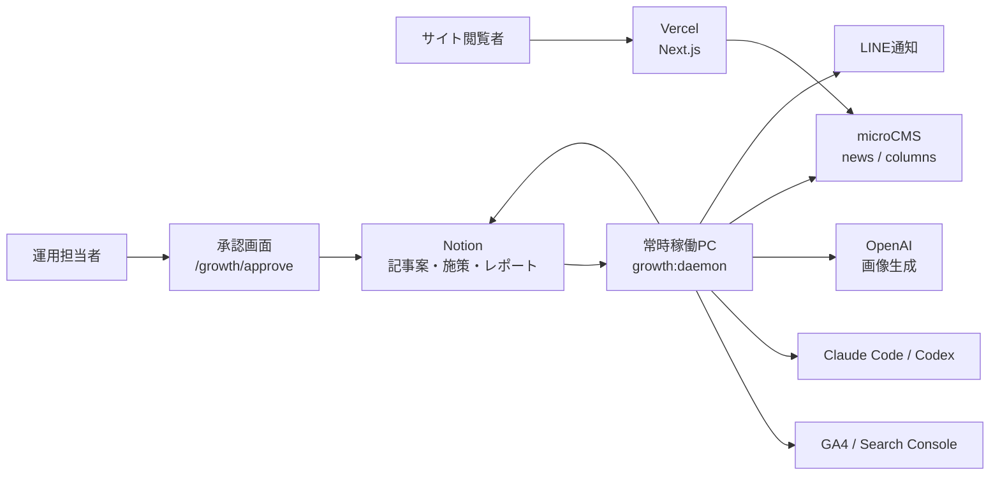
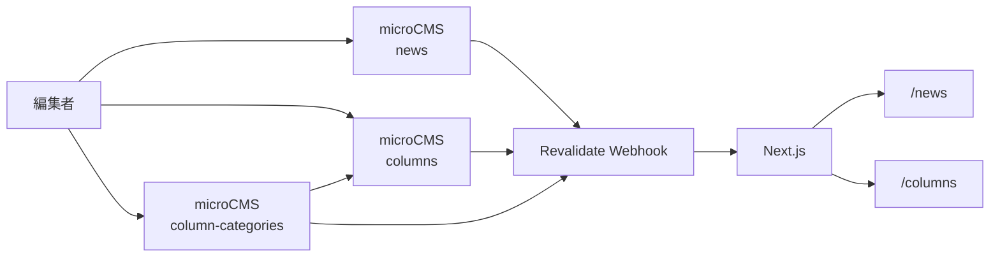
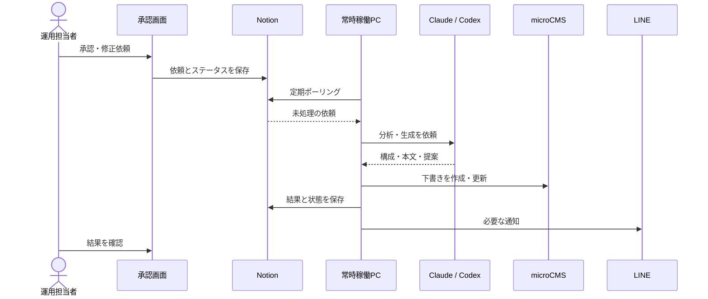
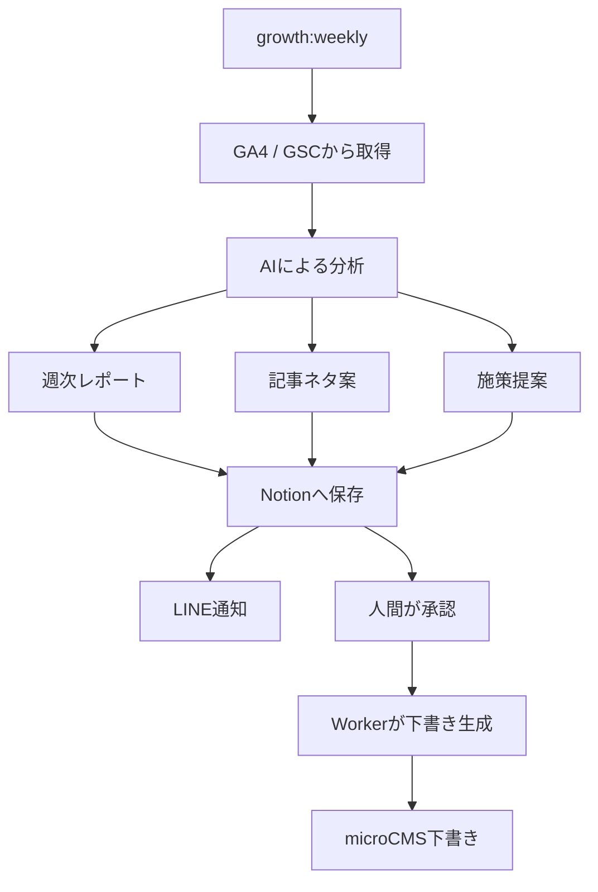
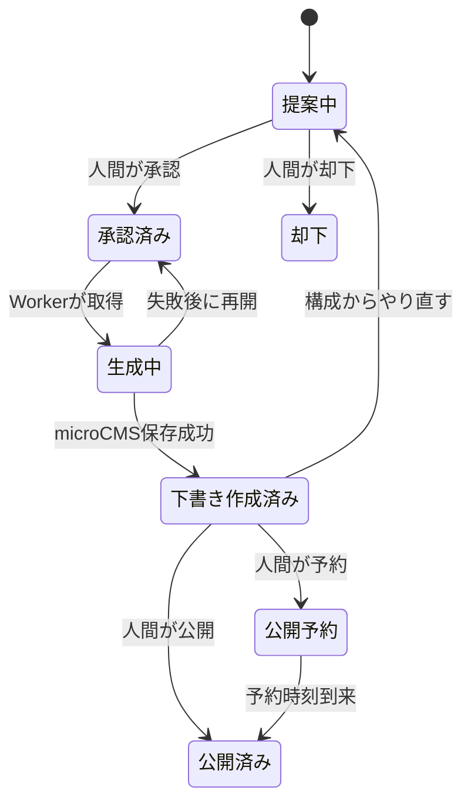

# THE PICKLE BANG THEORY

千葉県市川市のプレミアム屋内ピックルボール施設「THE PICKLE BANG THEORY」の公式Webサイトです。

公開サイトに加えて、microCMSによるニュース・コラム管理、Notionを中心とした記事制作、GA4 / Search Consoleの分析、AIを利用した下書き生成を行うグロース基盤を同じリポジトリで管理しています。

- Production: [https://www.thepicklebang.com](https://www.thepicklebang.com)
- Default branch: `develop`
- Languages: 日本語 / English

## 主な機能

### 公開サイト

- ピックルボール／HYROXの施設・料金・サービス案内と予約導線
- microCMSによるニュース・コラム、日本語・英語のローカライズ
- SEO、構造化データ、GA4、Vercel Analytics
- Resendによるお問い合わせ・メール登録、メンテナンスモード

### グロース基盤

- GA4 / Search Consoleの分析とNotionへのレポート・記事案・施策保存
- 人間の承認を起点とするClaude Code / Codexの記事制作
- OpenAIによる画像生成とmicroCMSの下書き・予約公開
- LINE通知と常時稼働PCによるpull型Worker

## システム全体像

公開サイトと承認画面はVercel上のNext.jsで動作します。AI推論、画像生成、分析、microCMSへの書き込みなどの重い処理は、常時稼働PCのWorkerがNotionの依頼をpullして実行します。



### 責務分担

| コンポーネント | 主な責務 |
|---|---|
| Vercel / Next.js | 公開サイト、承認画面、Route Handler |
| 承認画面 | 人間の判断、依頼登録、状態・成果確認 |
| Notion | 記事案、施策、週次レポート、状態、学習ログ |
| 常時稼働PC | ポーリング、AI起動、外部API接続、再試行、定期処理 |
| Claude Code / Codex | 分析、構成、執筆、修正、提案生成 |
| OpenAI | アイキャッチ・本文画像生成 |
| microCMS | ニュース、コラム、下書き・公開記事の保存 |
| GA4 / Search Console | アクセス・検索成果データ |
| LINE | 週次完了と重要な失敗の通知 |

## 主なページ

日本語はlocale prefixなし、英語は `/en` prefixで提供します。

| パス | 内容 |
|---|---|
| `/` | トップページ |
| `/about` | 運営者・選手紹介 |
| `/hyrox` | HYROX施設・プログラム |
| `/reserve` | ピックルボール・HYROX予約案内 |
| `/news` | ニュース一覧・詳細 |
| `/columns` | コラム一覧・詳細 |
| `/teaser` | ティザー・メンテナンス表示 |
| `/tokushoho` | 特定商取引法表記 |
| `/growth/approve` | 社内向けグロース承認画面 |
| `/growth/approve-proto` | 承認画面プロトタイプ |

## 技術スタック

| 領域 | 技術 |
|---|---|
| Web | Next.js 16、React 19、TypeScript 5.9 |
| UI | Tailwind CSS 4、Framer Motion |
| 国際化 | next-intl |
| CMS | microCMS |
| データ取得・検証 | TanStack Query、Zod |
| リッチテキスト編集 | TipTap |
| メール | Resend |
| 分析 | GA4、Google Search Console、Vercel Analytics |
| AI | Claude Code、Codex、OpenAI Image API |
| 運用 | Notion、LINE Messaging API |
| テスト | Vitest、React Testing Library、MSW |
| ホスティング | Vercel |

## 必要環境

- Node.js 22.x（CIと同じバージョンを推奨）
- npm
- Git

グロースWorkerを本番運用する場合は、上記に加えてClaude Code CLI、Codex CLI、および各外部サービスの認証情報が必要です。詳細は[グロースループ設定マニュアル](docs/operations/growth/01-setup-guide.md)を参照してください。

## セットアップ

```bash
git clone https://github.com/Akihiro1028Bad/bigban-site.git
cd bigban-site
npm ci
cp .env.example .env
npm run dev
```

[http://localhost:3000](http://localhost:3000)を開きます。

最小限のサイト表示では、次の値をローカル用に設定します。

```env
NEXT_PUBLIC_SITE_URL=http://localhost:3000
```

CMS、メール、グロース機能を利用する場合は、対象サービスの環境変数も設定してください。秘密値をコードやドキュメントへコミットしないでください。

## 環境変数

環境変数の名前、配置先、推奨値の正典は[`.env.example`](.env.example)です。秘密値はコミットせず、次の配置先に分けて管理します。

| 配置先 | 主な設定 |
|---|---|
| 共通 | サイトURL、microCMS、Notion、承認secret |
| Vercel | サイト表示、認証、Resend、Webhook、feature flag |
| 常時稼働PC | GA4 / GSC、LINE、OpenAI、Worker、AI実行設定 |

代表的なVercel用feature flagは次のとおりです。

```env
NEXT_PUBLIC_MAINTENANCE=false
USE_CMS_NEWS=false
USE_CMS_COLUMNS=false
APPROVE_AUTH_ENABLED=true
```

通常は承認画面の「AIモデル」で工程別設定を管理し、モデル関連の環境変数は一時的な上書きにのみ利用します。

## 利用可能なコマンド

### Web開発・品質確認

```bash
npm run dev           # 開発サーバー
npm run build         # production build
npm run start         # build済みアプリを起動
npm run lint          # ESLint
npm test              # Vitest
npm run test:watch    # Vitest watch mode
npm run test:coverage # カバレッジ付きテスト
npx tsc --noEmit
```

### グロース基盤

| 分類 | 主なコマンド |
|---|---|
| 中核 | `growth:daemon`、`growth:weekly`、`growth:drafts`、`growth:initiatives` |
| 修正 | `growth:revise-loop`、`growth:advise-loop`、`growth:decorate-loop`、`growth:comment-revise-loop` |
| 画像 | `growth:regen-loop`、`growth:regen-body-loop` |
| 計測・保守 | `growth:metrics`、`growth:publish-due`、`growth:review-due`、`growth:reconcile`、`growth:stall-check` |

すべて`npm run <コマンド>`で実行します。例: `npm run growth:daemon`。

多くのグロースコマンドは、外部サービスへ書き込まないdry-runに対応しています。

```bash
GROWTH_DRYRUN=1 npm run growth:weekly
GROWTH_DRYRUN=1 npm run growth:metrics
```

全コマンドと運用手順は[日常運用ガイド](docs/operations/growth/10-operator-guide.md)および[週次グロース運用Runbook](docs/operations/growth-weekly-runbook.md)を参照してください。

## CMSアーキテクチャ

告知系コンテンツと検索・学習資産を分離しています。

- `news`: お知らせ、メディア掲載、イベント、キャンペーン
- `columns`: グロース記事、検索流入向けコラム
- `column-categories`: コラムの読者向けカテゴリマスタ



microCMSの公開・更新時は `${SITE_URL}/api/revalidate` が呼ばれ、関連するNext.jsキャッシュを更新します。下書きはsecret付きの `/api/draft/enable` を経由してプレビューできます。

詳細は次の資料を参照してください。

- [ニュース運用マニュアル](docs/operations/news-admin-manual.md)
- [コラムCMSセットアップ](docs/operations/columns/setup-manual.md)
- [ニュースCMS連携設計](docs/superpowers/specs/2026-04-19-news-cms-integration-design.md)

## グロースアーキテクチャ

### pull型処理

承認画面はNotionに依頼と状態を書き、常時稼働PCが依頼を取得します。Vercel上で長時間のAI処理を行わないことで、タイムアウト、秘密情報、再試行をWorker側へ集約しています。



### 週次分析から下書きまで



### 記事の状態遷移

次は開発者が処理を理解するための概念図です。厳密なNotionプロパティとガード条件は[Notionプロパティ正典](docs/operations/growth/40-notion-props.md)を参照してください。



### 実装上の境界

- `scripts/growth/`: Worker、CLI、外部I/O、共有可能な純ロジック
- `scripts/growth/run.mjs`: Claude Code / Codexを起動するランチャー
- `src/lib/growth/`: Web側で利用するグロースロジック
- `src/app/growth/approve/`: 承認画面
- `src/app/api/growth/`: 承認画面用Route Handler
- `docs/operations/growth/`: 現行運用の正典
- `data/`: Workerのログ・失敗記録
- `.growth-tmp/`: 生成途中の一時成果物

I/Oを含むCLIとDOM非依存の純ロジックを分け、純ロジックをVitestで検証するのが基本方針です。CLI、AIランチャー、画像生成の薄い配線は必要に応じてカバレッジ対象外とし、その境界の純ロジックをテストします。

### 正典の優先順位

記事生成時に情報が矛盾した場合は、次の順序を優先します。

1. [`scripts/growth/facility-context.json`](scripts/growth/facility-context.json): 施設の現況・確定事実・未確定事項
2. [`docs/operations/growth-article-style.md`](docs/operations/growth-article-style.md): 文体・構成・NG表現
3. [`docs/operations/growth-weekly-runbook.md`](docs/operations/growth-weekly-runbook.md): 実行手順

詳細は[グロースループ正典](docs/operations/growth/00-canon.md)を参照してください。

## ディレクトリ構成

```text
src/
  app/                       Next.js App Router、Route Handler
    [locale]/                日本語・英語の公開ページ
    api/                     contact、CMS、growth API
    growth/                  社内向け承認画面
  components/                ページ・機能別Reactコンポーネント
  config/                    feature flag
  constants/                 URL、料金、カテゴリなどの定数
  hooks/                     React hooks
  i18n/                      next-intl routing
  lib/
    analytics/               イベント計測
    columns/                 コラムの表示ロジック
    growth/                  グロースWeb層ロジック
    microcms/                microCMS client・schema・query
    news/                    ニュース本文・サニタイズ
scripts/
  growth/                    グロースWorker・CLI・純ロジック
docs/
  operations/                運用正典・セットアップ
  superpowers/specs/         設計書
  superpowers/plans/         実装計画
messages/                    ja / en翻訳
public/                      画像・ロゴなどの静的ファイル
```

## テストとCI

新機能・バグ修正はRed → Green → RefactorのTDDで進めます。

Pull RequestではGitHub Actionsが次を実行します。

```bash
npm ci
node scripts/check-prod-auth.mjs
npx tsc --noEmit
npm run lint
npm run test:coverage
npm run build
```

- カバレッジ基準はstatements / branches / functions / linesの100%
- コンポーネントはReact Testing Libraryで振る舞いを検証
- API通信はMSWを利用
- snapshot testではなく、roleやlabelを使った利用者視点のテストを優先

## セキュリティと運用上の注意

- `MICROCMS_API_KEY`、`NOTION_TOKEN`、`OPENAI_API_KEY`などの秘密値をコミットしない
- `MICROCMS_API_KEY`に`NEXT_PUBLIC_`を付けず、server-onlyを維持する
- 本番の `/growth/approve` は合言葉認証を必須にする
- `APPROVE_AUTH_ENABLED=false`のVercel Production buildは禁止される
- AIは自律判断で記事を本番公開しない。記事案の承認は下書き生成の許可であり、公開権限ではない
- 即時公開は再認証した人間の明示操作で行い、予約公開は人間が予約した記事だけを非AIのWorkerが決定的に処理する
- headless agentからの`git commit`と`git push`を許可しない
- 失敗を沈黙させず、再開コマンドとログを残す
- Worker処理は冪等性を維持し、安全に再実行できるようにする

## 関連ドキュメント

### グロース

- 基本: [正典](docs/operations/growth/00-canon.md) / [初期構築](docs/operations/growth/01-setup-guide.md) / [日常運用](docs/operations/growth/10-operator-guide.md)
- 処理: [下書き](docs/operations/growth/20-draft.md) / [修正・再生成](docs/operations/growth/30-loops.md) / [公開・計測](docs/operations/growth/50-publish-metrics.md)
- データ: [Notionプロパティ](docs/operations/growth/40-notion-props.md) / [KPIツリー](docs/operations/growth/60-kpi-tree.md) / [自己改善](docs/operations/growth/70-self-tuning.md)
- 品質・監視: [Worker監視](docs/operations/growth/worker-observability.md) / [記事スタイル](docs/operations/growth-article-style.md) / [週次Runbook](docs/operations/growth-weekly-runbook.md)

### CMS

- [ニュース運用](docs/operations/news-admin-manual.md) / [AIニュース生成](docs/operations/ai-news-prompt.md) / [コラムCMSセットアップ](docs/operations/columns/setup-manual.md)

### 開発ルール

- [AGENTS.md](AGENTS.md) / [CLAUDE.md](CLAUDE.md)
