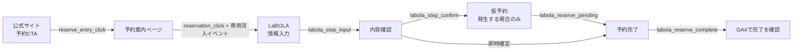

# GA4 × LaBOLA 予約導線の計測手順

> 対象範囲: 公式サイトの予約CTAから、LaBOLA内の入力・確認・仮予約・予約完了まで。
> CSV取り込みと分析画面はこの手順の対象外。GA4 Data APIでは、検証済みイベントを週次提案の参考値として取得する。
> 作業者: LaBOLA管理画面とGA4管理画面を操作できる人。

## 1. 何を計測するか



公式サイト側の2イベントは実装済みである。

| 場所 | イベント | 意味 |
|---|---|---|
| 公式サイト各所 | `reserve_entry_click` | 予約案内ページへ進む |
| 予約案内ページ | `reservation_click` | 選択した予約先へ移動する |
| 予約案内ページ | `labola_entry_rental` | LaBOLAの通常予約へ移動する |
| 予約案内ページ | `labola_entry_program` | LaBOLAのプログラム予約へ移動する |

`reservation_click` は従来の予約意図指標として維持する。週次のLaBOLA導線集計には、GA4カスタムディメンションの手動登録を必要としない専用流入イベントを使う。予約先はLaBOLAに一本化済みのため、予約案内ページの全カードが専用流入イベントを伴う。

LaBOLA内部は、LaBOLAの画面別タグ欄の単位に合わせて次の2系統に分ける。

| 段階 | 通常予約 | プログラム予約 |
|---|---|---|
| 情報入力 | `labola_step_input` | `labola_step_input_program` |
| 内容確認 | `labola_step_confirm` | `labola_step_confirm_program` |
| 仮予約 | `labola_reserve_pending` | `labola_reserve_pending_program` |
| 予約完了 | `labola_reserve_complete` | `labola_reserve_complete_program` |

通常予約系のイベントだけでは、LaBOLA内部のピックルボールとHYROXエリアを分離できない。公式サイトからLaBOLAへ進んだ時点では両者を通常予約として合算し、動的な予約種別をLaBOLAから渡せることが確認できるまでは、入力後の内訳を推測しない。

## 2. LaBOLA管理画面へタグを設定する

測定IDはサイト本体と同じ `G-XEP1C5L70P` を使う。正本は `src/constants/analytics.ts`。

LaBOLA管理画面の **システム設定 > 予約サービス > 予約画面** にある画面別コンバージョンタグ欄へ設定する。各欄には対応するタグを1つだけ置く。

### 2-1. 通常予約の4画面

以下の `EVENT_NAME` を画面に対応する通常予約イベント名へ置き換える。

```html
<!-- Google tag (gtag.js) -->
<script async src="https://www.googletagmanager.com/gtag/js?id=G-XEP1C5L70P"></script>
<script>
  window.dataLayer = window.dataLayer || [];
  function gtag(){dataLayer.push(arguments);}
  gtag('js', new Date());
  gtag('config', 'G-XEP1C5L70P');
  gtag('event', 'EVENT_NAME');
</script>
```

- 情報入力画面: `labola_step_input`
- 内容確認画面: `labola_step_confirm`
- 仮予約画面: `labola_reserve_pending`
- 予約完了画面: `labola_reserve_complete`

### 2-2. プログラム予約の4画面

プログラム系専用タグ欄にも同じタグを設定し、`EVENT_NAME` だけを次の値にする。

- プログラム情報入力画面: `labola_step_input_program`
- プログラム内容確認画面: `labola_step_confirm_program`
- プログラム仮予約画面: `labola_reserve_pending_program`
- プログラム予約完了画面: `labola_reserve_complete_program`

### 2-3. 重複と個人情報を防ぐ

- 同じ画面のタグ欄に同じイベントを複数置かない。
- 既存のGoogleタグがある場合は、測定IDとイベント名を確認してから追加する。
- 氏名、メールアドレス、電話番号、会員番号、予約番号、自由入力文をイベントパラメータへ入れない。
- このタグへ独自パラメータを追加しない。追加が必要になった場合は、値に個人情報が含まれないことを別途レビューする。
- 入力・確認画面は戻る操作や再読み込みでも表示されるため、イベント件数を予約人数とは扱わない。
- 仮予約を経由しない即時確定フローでは、`labola_reserve_pending` が0件でも異常ではない。
- 予約完了イベントもブラウザの再読み込みなどで重複し得る。売上や予約件数の正本にはせず、導線計測として扱う。

保存後は各タグ欄を開き直し、`<script>` とイベント名が消去・変換されていないことを確認する。

## 3. GA4のクロスドメイン設定

GA4の対象ウェブストリームで次を設定する。専用流入イベントはイベント名だけで集計するため、カスタムディメンションの追加は不要。

1. **管理 > データストリーム > ウェブストリーム > タグ設定を行う > ドメインの設定**を開く。
2. `yoyaku.labola.jp` を追加する。
3. **除外する参照元の一覧**にも `yoyaku.labola.jp` を追加する。
4. テスト着弾後、`labola_reserve_complete` と `labola_reserve_complete_program` だけをキーイベントにする。

入力・確認・仮予約イベントは途中経過なので、キーイベントにはしない。

週次集計は、公式サイトの専用流入イベントが本番反映された後の最初の完全な週である **2026年7月27日（月）** から開始する。それ以前のLaBOLAイベントは段階間比較へ混ぜない。本番反映が7月27日以降へ遅れる場合は、`LABOLA_MEASUREMENT_START_YMD` を反映後最初の月曜日へ変更してから運用する。

## 4. 本番で受信確認する

サイト本体のGA4は本番環境だけで有効になるため、本番URLからテストする。

1. GA4のリアルタイムレポートを開く。
2. 本番サイトで予約CTAを押し、予約案内ページからLaBOLAへ進む。
3. 通常予約を1件、可能ならプログラム予約も1件、完了まで操作する。
4. 次を確認する。

- [ ] `reserve_entry_click` が1回以上着弾する
- [ ] `reservation_click` が1回以上着弾する
- [ ] 通常予約への移動で `labola_entry_rental` が着弾する
- [ ] プログラム予約への移動で `labola_entry_program` が着弾する
- [ ] 通常予約の入力・確認・完了イベントが着弾する
- [ ] プログラムを試した場合、`_program` 系イベントが着弾する
- [ ] 即時確定の場合、仮予約イベントが無くても完了イベントは着弾する
- [ ] LaBOLA遷移後に参照元が `yoyaku.labola.jp` や `(direct)` へ切り替わっていない
- [ ] GA4のイベントパラメータに氏名・メールアドレス・電話番号などが無い
- [ ] 同じ画面に同名イベントが二重で設定されていない

テスト予約はLaBOLA側でキャンセルし、社内のテスト実施記録へ日時と対象フローだけを残す。個人情報は記録しない。

## 5. 完了条件

- 通常予約とプログラム予約の8イベントが、対応する画面へ各1つ設定されている。
- 公式サイトの2イベントとLaBOLAの完了イベントをGA4リアルタイムで確認できる。
- LaBOLAへの移動時に、通常予約・プログラム予約の専用流入イベントを確認できる。
- クロスドメイン設定後もセッションがLaBOLA参照やdirectに分断されない。
- 完了2イベントだけがキーイベントになっている。
- 送信内容に個人情報が含まれない。

ここまでで本PRの計測追加と週次提案への参考値接続は完了とする。CSVとの照合と分析画面への表示は別PRで行う。
