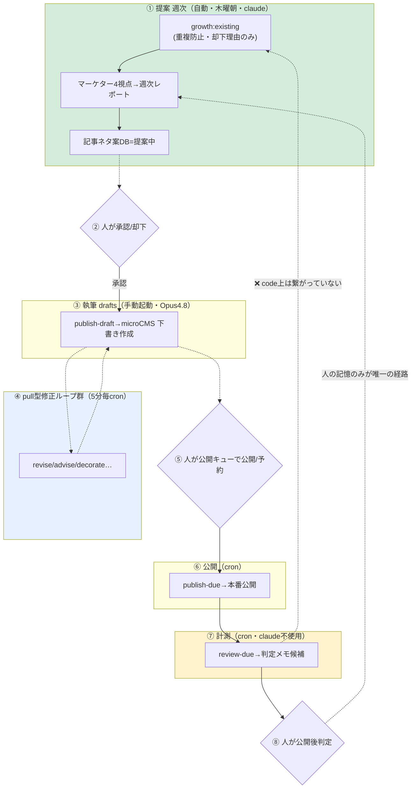
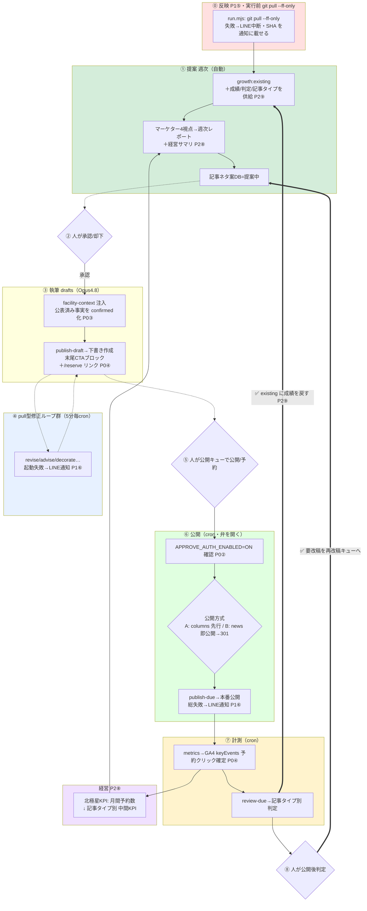

# グロースループ To-Be 再設計 — 外界との接続点を閉じる

- 日付: 2026-07-03
- ステータス: ドラフト（意思決定待ち）
- 対象: `THE PICKLE BANG THEORY`（千葉県市川市・本八幡 / 屋内ピックルボール専用施設 / 2026-04-18 開業済）
- 入力レビュー: `growth-review/01-engineering-asis.md`（エンジニアリング as-is）・`02-marketing-review.md`（マーケティング）・`03-business-review.md`（経営 ROI/ガバナンス）
- 関連: `2026-06-12-growth-loop-mvp-design.md`（MVP 設計）/ `2026-07-02-columns-cms-separation-design.md`（コラム分離）/ `docs/operations/growth/00-canon.md`〜`50-publish-metrics.md`
- Issue 草案: `growth-review/04-issue-drafts.md`（A〜G・起票前）

---

## 経営者が5分で読める意思決定サマリ

> **改訂（2026-07-03・オーナー前提修正）**: 記事生成ツールは**まだ開発途中**であり、「公開ゼロ」は運用の詰まりではなく**意図した未ローンチ**である。したがって本設計の P0「今週公開貫通」は「**ローンチ準備の完了 → クリーンな初公開**」に読み替える。公開方式はオーナー判断で **A（columns 先行整備）** を採用。公開実績ゼロのため **301 移行はそもそも不要**になり、news 滞留中の DRAFT 5本は CMS 内で columns へ下書きのまま移せばよい（A案のコストが当初見積もりより下がる）。緊急度の根拠だった「先行者不利の拡大」は変わらないため、**ローンチ準備を最短で完了させる**ことが新しい P0 である。詳細は §5 の後段「ローンチ準備トラック」を参照。

**現状評価** — このグロースループは「エンジンは精緻だが、外界との接続点が全て切れている」状態にある。記事生成・品質ゲート・文体ガイドは国内競合3メディア（ピクラ146本・ピックルボールワン・ピックルタイムス）のどれよりも「AI量産に陥らない仕組み」を緻密に持ち、単位コストは月数十〜二百ドルで施設の集客投資に対して誤差レベル。権限分離（削除操作の物理的不在・冪等公開・git push 禁止）も堅い。**設計は日本一を狙える。だが公開ゼロで、検索面を1つも取れていない。**

**最重要ファクト（公開ゼロの根本原因）** — 本番 microCMS の news は8件すべて DRAFT（グロース記事5本が 6/19-21 から `publishedAt=null` で滞留）。本番サイト `/news` は空状態、任意 slug は 404、sitemap に個別記事 slug は 0 件。**公開ゼロの原因は生成側ではなく、最終公開ゲートが稼働していないこと**。開業から約2.5ヶ月、競合は施設名でのローカル検索まで先取りしており、先行者不利が日々拡大している。エンジンは動いているのに、出口の弁が閉じたまま生成物が溜まっている。

**P0で今週やるべき4つ（ビジネス直結・低コスト）**
1. **公開ゼロ脱却** — 滞留中の DRAFT 5本を実際に公開まで貫通させる。運用の詰まり（承認画面/microCMS/画像生成）を実弾で洗い出す。公開1本＝検索面1つ獲得。
2. **本番認証フラグの実値確認** — `APPROVE_AUTH_ENABLED` が本番で ON であることを確認し、doc の「現在オフ」記載を現行コード（既定 ON）に修正。
3. **公表済み事実の解禁** — 営業時間 6:00-23:00・3面・デコターフは既に about/PR TIMES/連盟公式で公表済み。`doNotWrite` から外し、記事の一次情報密度を即上げる（料金・体験会日時のみ未確定として残す）。
4. **CTA 導線の計測確定** — 予約リンク（`/reserve`）を内部リンク許可リストに追加し、GA4 keyEvents（予約クリック）を計測確定。「予約クリック◯件/月」の成功指標を実測可能にする。

**ユーザーが決めること（2点）**
- **公開方式**: 滞留5本を (A)`/columns` を先に整備してから初公開するか、(B)`/news` で即公開して後から `/columns` へ 301 移行するか。→ 本文 §5「①公開ゼロ脱却」の比較表で判断材料を提示。**推奨は状況次第だが、スピード最優先なら B、URL 資産保護最優先なら A**。
- **実装着手の承認**: P0（今週）→ P1（基盤接続・2週）→ P2（学習と経営・3-4週）→ P3（コンテンツ資産・継続）の順で着手してよいか。

**期待効果** — P0 完了で「公開ゼロ」を脱し、ローカル×屋内×一次体験という無競合領域で検索面の獲得を開始。P1 で「自宅PCが旧版で走り続ける」「失敗が沈黙する」という無人運用の穴を塞ぐ。P2 で「記事投資が予約を生んだか」に答える KPI ツリーと学習ループを code に接続。ボトルネックは唯一つ、**公開ゼロを脱すること**であり、それは今週着手できる。

---

## 1. 診断サマリ（3視点の統合）

3つの独立レビュー（エンジニアリング・マーケティング・経営）は、**異なる入口から同一の結論**に到達している: 「精緻なエンジンに対して、外界との接続点が全て切れている」。

| 切れている接続点 | エンジニアリング根拠 | マーケ根拠 | 経営根拠 |
|---|---|---|---|
| **① 公開（本番への出口）** | columns 分離 P1–P4 済だが本番ドーマント（`endpoint.ts:20` 既定 `"news"`・`featureFlags.ts:12` `USE_CMS_COLUMNS` 既定 false）。DRAFT 5本が滞留 | 公開済みグロース記事 **0本**。`/news` 空・任意 slug 404・sitemap に記事 0（実測） | 公開は完全自動でなくオーナー操作依存。判断キューが律速 |
| **② 反映（自宅PCへの入口）** | `run.mjs` に `git pull` 皆無（grep 0件・`run.mjs:165` DISALLOW は push/commit のみ）。stale 検知も通知も無い | — | — |
| **③ 学習（計測→提案の弧）** | `existing.ts:63-72,88-127` が成績/判定/記事タイプを読まない。`reviewLabels` は生数値のみ（`metricsReview.ts`） | 公開後レビュー #C4 を回すデータが公開0本で存在しない | 「勝ちパターン増幅」の回路が弱い（§3.2）。避ける学習のみ |
| **④ 経営KPI（数字→判断）** | — | 成功指標「予約クリック5件/月」に対し記事内CTAが定性誘導（§1-2） | **北極星→記事KPIツリーが未定義**（§3.5・最大の穴）。keyEvents optional で CTA 因果が欠落 |
| **⑤ 認証 drift（本番前ゲート）** | `APPROVE_AUTH_ENABLED` 既定 ON（`featureFlags.ts:27`）だが doc は「現在オフ」（`runbook:494`・`draft/route.ts:12`） | — | 本番カットオーバーのフラグ確認が人手依存（§4.3 残リスク） |
| **⑥ 事実の封印（自傷）** | — | `doNotWrite` が公表済み事実（6:00-23:00・3面・デコターフ）まで封印（§1-3・設計ミス） | 誤情報 block は多層で堅いが、確定事実まで弾く副作用 |
| **⑦ 沈黙障害（無人運用の穴）** | loop 起動失敗無通知（`run.mjs:260-263`）・publish-due 総失敗無通知（`publish-due-cli.ts:152-155`）・生成中 reaper 不在（`staleJob.ts:13`）・LINE トークン破損で全沈黙（`notify-line.ts:38-42`） | — | 障害対応が週5〜25分の隠れコスト（§1） |

**統合診断**: エンジンは精緻（純ロジック分離・欠落耐性・段階ガード #H9・reaper・冪等公開）。しかし **公開・pull・学習・KPIツリー・認証drift の5点で外界との接続が切れており、その総合症状が「公開ゼロ」**。最初に閉じるべきは①公開の出口であり、それは今週着手できる（生成側は既に動いている）。

---

## 2. To-Be ワークフロー全体像

### 2.1 As-Is（01 レポートから引き継ぎ・赤破線が切れた弧）

**現実**: ⑥公開が本番ドーマントで止まり、DRAFT 5本が滞留（`endpoint.ts:20`＝news・`USE_CMS_COLUMNS` false）。⑦→①の学習弧は code に無い（赤破線）。

### 2.2 To-Be（pull→提案→執筆→承認→公開→計測→学習が閉じる）

**閉じた形**: ⓪反映で stale を防ぎ、⑥公開の弁を開き（P0）、⑦計測の keyEvents/記事タイプを⑧判定→①提案へ **code で戻す**（P2）。北極星KPI が週次レポートに載る（P2⑧）。太い矢印（==>）が新設された学習弧。

---

## 3. P0 — 今週・ビジネス直結

> 目標: 公開ゼロを脱し、本番前ゲートと事実・計測の基盤を整える。すべて低コスト・高インパクト。

### P0① 公開ゼロ脱却（DRAFT 5本の公開貫通）

- **目的（ビジネス効果）**: 検索面の獲得を開始する。公開1本＝検索面1つ。運用の詰まり（承認画面/microCMS/画像生成/公開キュー）を実弾で洗い出し、以降のスループットを確立する。現状の最大損失（精緻な設計が本番に1本も到達していない）を直接解消。
- **具体設計**: 滞留中の DRAFT 5本（6/19-21 から `publishedAt=null`）を承認画面の公開キューから公開まで通す。**公開方式は §5 の比較表でユーザーが A/B を選択**。選択後:
  - A（columns 先行）を選ぶ場合: columns 分離 §7 の P5（準備）→ P6（切替）を先に済ませ、`/columns` で初公開（P1⑦と統合）。
  - B（news 先行）を選ぶ場合: `USE_CMS_COLUMNS` OFF のまま `/news` で即公開。後日 columns 移行時に個別 301（`next.config.ts` の `redirects()`）。
- **受け入れ基準**:
  - [ ] 本番サイトで滞留5本のうち少なくとも1本が実際にレンダリングされ、sitemap に slug が載る。
  - [ ] 公開経路（承認画面→publish or publish-due）が end-to-end で1回成功し、手順が runbook に反映。
  - [ ] 選択した公開方式（A/B）が記録され、以降の記事も同方式で一貫。
- **概算工数**: B（news 先行）= **0.5〜1人日**（既存経路をそのまま使う・実質は公開操作＋詰まり修正）。A（columns 先行）= **3〜5人日**（columns P5/P6 の実装込み・P1⑦と重複計上）。
- **依存**: P0②（認証 ON 確認）を先に。A を選ぶ場合は P1⑦に依存。

### P0② 本番 APPROVE_AUTH_ENABLED 実値確認＋doc 修正

- **目的**: 本番前に承認系 API のフェイルオープンを排除する。`APPROVE_AUTH_ENABLED=false` が1つでも残ると `draft`/`draft/edit`/`approve`/`revert` が全許可＝誰でも microCMS 下書きを読み書き可（`publish` のみ無効時も拒否・`publish/route.ts:66`）。
- **具体設計**: (1) Vercel 本番 env の実値を確認（未設定 or `!= "false"` を保証）。(2) doc の「現在オフ」記載3箇所（`runbook:494`・`draft/route.ts:12`・`draft/edit/route.ts:9`）を現行コード（既定 ON・フェイルセーフ・`featureFlags.ts:27`）に合わせて修正。**stale なのは doc 側**。(3) `check-prod-auth.mjs`（prebuild ガード）を CI 必須に格上げ。→ Issue A。
- **受け入れ基準**:
  - [ ] 本番 env が「未設定 or `true`」であることを確認・記録。
  - [ ] `grep -rn "現在オフ\|オフのまま" docs src` が 0 件。
  - [ ] `check-prod-auth.mjs` が CI で `false` を検知したら fail。
- **概算工数**: **0.25〜0.5人日**（確認＋doc 修正が主・CI 追加含む）。
- **依存**: なし（P0① の前提）。

### P0③ facility-context doNotWrite の公表済み事実を解禁

- **目的**: 記事の一次情報密度を即上げ、一般論記事化を防ぐ。公表済み事実を封じると競合との差別化（E-E-A-T）が消える。
- **具体設計**: `facility-context.json:14-20` の `doNotWrite` から「営業時間・定休日」「コート面数」を外し `confirmed` へ移す（6:00-23:00・3面・デコターフ）。**料金・体験会日時のみ未確定として残す**。併せて `draftQuality.ts` の `detectDoNotWrite()`・`publishGate.ts` の `evaluatePublishGate()` の営業時間/面数パターンを、**「確定値と一致する記述は block しない／矛盾する断定のみ block」** に振る（最小実装は該当パターンの block 解除＋confirmed 注入）。→ Issue B。施設側への最終事実確認を1点取る。
- **受け入れ基準**:
  - [ ] `confirmed` に営業時間・面数・サーフェスが入り、`doNotWrite` は料金・体験会日時（＋必要なら所要分）のみ。
  - [ ] 「6:00-23:00」「3面」を含む下書きが block されない。未確定の**料金**を断定する本文は従来どおり block（回帰なし）。
  - [ ] `draftQuality.test.ts` 等が確定値解禁に合わせて更新され green。
- **概算工数**: **0.5〜1人日**（JSON 変更は即・ゲートの正規表現調整とテスト更新が主）。
- **依存**: なし（施設側の事実確認のみ人手）。

### P0④ 内部リンク許可リストに /reserve 追加＋keyEvents 計測確定

- **目的**: 「予約クリック◯件/月」の成功指標を実測可能にし、記事→予約の因果を計測に載せる。現状は CTA 先が許可リストに無く、keyEvents が optional で計測保証が無い。
- **具体設計**: (1) `growth-article-style.md §15`（`:298-301`）の有効内部リンク先に `/ja`（トップ）＋**予約導線 `/reserve`・`/contact`** を追加。§15 内の矛盾（`:284` の「`/contact` 可」vs `:298-301` の許可リスト）を解消。(2) 記事末に「アクセス（本八幡駅徒歩1分・6:00-23:00）＋予約ボタン」の定型 CTA ブロックの運用ルールを追記（コンポーネント化は P1〜で可）。(3) GA4 で予約ボタン/LINE 追加/Instagram 遷移を **key event として設定**し、`metrics.ts:44-45` が拾う keyEvents を PerformanceBoard に常時表示、`成功指標` と紐付け。→ Issue C。
- **受け入れ基準**:
  - [ ] §15 許可リストに予約導線が明記され矛盾が解消。予約導線を含む下書きが「壊れた内部リンク」で block されない。
  - [ ] GA4 に予約 key event が設定され、`metrics.ts` が拾った keyEvents がボードに表示（1記事以上で実データ確認）。
- **概算工数**: **1〜2人日**（doc＋GA4 設定＋ボード表示確認・CTA コンポーネント化は別途）。
- **依存**: P0① で公開が始まって初めて keyEvents に実データが乗る。

---

## 4. P1 — 基盤接続（2週）

> 目標: 無人運用の「気づけない失敗」を塞ぐ。反映経路・沈黙障害・columns 残作業。

### P1⑤ run.mjs 実行前 git pull（ff-only・失敗時LINE中断）

- **目的**: 自宅PCが旧版で走り続ける stale 事故を防ぐ。プロンプト・正典・マッピングを更新しても、pull されるまで旧前提で記事が生成され続け誰も気づかない（as-is §3-1 CRITICAL）。
- **具体設計**: `run.mjs` の各モード起動**前**に `git pull --ff-only`（対象ブランチ固定）。**失敗（非 ff・conflict・ネットワーク断）時は工程を中断し LINE 通知**（絶対禁止「失敗を沈黙させない」に整合）。push/commit は DISALLOW 維持（`run.mjs:165`）。Windows `.bat`（`growth-windows-setup.md` §6/§6.5）にも同等ステップ、または `run.mjs` に一本化。実行 SHA を LINE 成功通知に載せ Web デプロイ（`promptRegistry.ts` 「デプロイ時点」）と突合可能に。`GROWTH_DRYRUN=1` では safe skip。→ Issue D。
- **受け入れ基準**:
  - [ ] 全モードで pull 前置。`--ff-only` 失敗時に exit≠0＋LINE＋工程名/再開コマンド出力。
  - [ ] push/commit は依然 headless から不可。通知に実行 SHA を含む。
  - [ ] `GROWTH_DRYRUN=1` で pull が no-op。
- **概算工数**: **1〜2人日**（run.mjs 配線＋.bat＋動作確認・カバレッジ除外領域）。
- **依存**: なし。

### P1⑥ 沈黙障害の致命分を通知化

- **目的**: 気づけない失敗経路を潰す。「失敗を沈黙させない」を全モードへ徹底。
- **具体設計**（as-is §3 CRITICAL/HIGH）:
  1. loop モードの `child.on("error")`・非0 exit で **LINE 通知**（weekly 同水準・現状 `run.mjs:260-263` は stderr のみ）。→ loop 起動失敗（サブスク切れ・PATH 崩れ）の全沈黙を解消。
  2. `publish-due-cli.ts:121-124,152-155` の総失敗・不正 contentId スキップを **LINE 通知**（publish-draft と対称に）。
  3. `生成中`（drafts）の滞留検知を追加（reaper 対象化 or cron 側滞留通知・現状 `staleJob.ts:13` は pull 型専用）。`requestedAt=null` 行（`staleJob.ts:23-28`）の救済経路。
  4. （関連・別枠可）LINE トークン破損で全通知が同時沈黙（`notify-line.ts:38-42`）＝通知網の単一障害点。フォールバック検討はメモとして残す。
  → Issue E。
- **受け入れ基準**:
  - [ ] loop 起動失敗で LINE（PATH を壊して確認）。publish-due 総失敗/スキップで LINE。
  - [ ] `生成中` 滞留が通知される or reaper 対象。`requestedAt=null` の wedge が放置されない。
  - [ ] 純ロジックを新規/更新テストで覆う。
- **概算工数**: **2〜4人日**（4項目・純ロジック中心でテスト書きやすい）。
- **依存**: なし。

### P1⑦ columns P5/P6 残作業（P0① と統合）

- **目的**: エバーグリーン記事を鮮度型 `/news/` から `/columns/` サイロへ分離し、SEO トピッククラスタを成立させる。設計は完成済み（`2026-07-02-columns-cms-separation-design.md`）で残るは実装フェーズ。
- **具体設計**: 同設計 §7 の P5（準備・フラグ OFF）: columns/column-categories API を管理画面で作成、カテゴリ seed、`next.config.ts` の `redirects()` に個別 301 を**用意**（マージは P6）。P6（切替）: `USE_CMS_COLUMNS=true`＋301 を**同一デプロイ**で有効化、news→columns 複製・非公開化。**順序厳守**（フラグ OFF のまま 301 を先に出すと 404 期間が生じ検索評価を毀損・§7 明記）。P0①で B（news 先行）を選んだ場合はここが「後追い移行」になる。
- **受け入れ基準**:
  - [ ] `/columns/[slug]` が本番で描画され、`/news/:slug`→`/columns/:slug` の 301 が効く。
  - [ ] Search Console で 301 反映を確認（検索順位の維持）。
  - [ ] `GROWTH_MICROCMS_ENDPOINT=columns`＋`USE_CMS_COLUMNS=true` で新規記事が columns へ。
- **概算工数**: **3〜5人日**（管理画面手動作業＋301 列挙＋切替確認・既存設計に沿うため設計工数ゼロ）。
- **依存**: P0①（公開方式の選択）。A を選ぶと P0① と同時、B なら後続。

---

## 5. ユーザー判断材料 — columns 先行公開 vs news 先行公開

**論点**: 滞留中の DRAFT 5本（および今後の記事）を、どちらの URL 階層で初公開するか。

| 観点 | A: columns 先行公開 | B: news 先行公開→後で 301 移行 |
|---|---|---|
| **公開までのスピード** | 遅い（columns/column-categories API 作成・カテゴリ seed・ルート確認が前提）。**今週の公開ゼロ脱却が数日後ろ倒し** | **速い**（既存 news 経路をそのまま使う・実質は公開操作のみ）。今週中に公開可能 |
| **URL 移行コスト** | **ゼロ**（最初から `/columns/` で確定。301 不要） | 発生（後日 `/news/:slug`→`/columns/:slug` の個別 301 を `next.config.ts` に列挙・記事数分。ワイルドカード不可＝告知記事は news 残留） |
| **SEO（検索評価）** | **最良**（URL が最初から確定・評価が一貫。サイロ構造を最初から） | 二段階リスク（一度 `/news/` で評価を積んでから 301 移行。301 は評価を概ね引き継ぐが、移行期の順位揺れ・404 期間リスク。順序厳守が必須） |
| **実装工数** | 3〜5人日（columns P5/P6 込み） | 0.5〜1人日（即公開）＋後日 3〜5人日（移行時） |
| **本数の少なさとの相性** | 本数が少ない今がベスト（301 対象が最小） | 公開を待たせないが、移行時の 301 本数は公開本数に比例して増える |
| **リスク** | 公開ゼロ脱却が遅れる＝先行者不利がその分継続（マーケ最重要課題） | 移行時の 301 順序ミスで検索評価毀損（§7 の警告）。運用が2段階 |

**トレードオフの本質**: **スピード（今すぐ検索面を取る）vs URL 資産保護（最初から正しい階層）**。マーケレビューは「公開ゼロ脱却が最大かつ唯一の課題」とし、経営レビューは「先行者不利が日々拡大」とする。この2点を重く見るなら **B（news 先行で今週公開→P1⑦で 301 移行）** が整合的。一方、記事本数が今まさに最小で 301 対象が少ない点を重視し、URL 揺れを一切避けたいなら **A（columns 先行）**。

> **推奨（弱め）**: 公開ゼロ脱却の緊急性を踏まえ **B を推奨**。ただし A の「301 対象が今が最小」も合理的な反論であり、**ユーザーが決定する事項**。どちらでも品質ゲート・生成側は不変。

### 5.1 決定（2026-07-03）とローンチ準備トラック

**オーナー決定: A（columns 先行）を採用**。あわせて前提が修正された — ツールは開発途中であり「公開ゼロ」は意図した未ローンチ。これにより:
- **301 移行は完全に不要**（公開実績ゼロ。B案の後日移行コスト 3〜5人日が消滅し、A案の相対コストが下がる）。
- news 滞留中の DRAFT 5本は **CMS 内で columns へ下書きのまま移行**（MCP で複製→news 側は下書きのまま放置 or 削除。公開URLが無いので手順自由）。

**ローンチ準備トラック（新P0・順序どおり）**

| # | 作業 | 依存 issue | 種別 |
|---|---|---|---|
| L1 | 本番 `APPROVE_AUTH_ENABLED` 実値確認＋doc修正（公開前の必須セキュリティゲート） | #216 | 確認+doc |
| L2 | `doNotWrite` 公表済み事実の解禁（以後の下書き品質の底上げ。滞留5本の扱いにも影響） | #217 | データ+ゲート調整 |
| L3 | columns 本番整備 = prod microCMS セットアップ（API・カテゴリseed・category参照・Webhook。手順書 `docs/operations/columns/setup-manual.md`）＋ P5/P6 コード側（`USE_CMS_COLUMNS`・`GROWTH_MICROCMS_ENDPOINT`・ナビ COLUMN 追加・`/news/` ハードコード3箇所の連動化。**301 は削除**） | 設計書 P1⑦ | 実装+手動 |
| L4 | CTA 導線＋keyEvents 計測確定（公開初日から計測が効くように） | #218 | 実装+GA4設定 |
| L5 | 滞留5本の columns 移行と磨き込み（L2 解禁後に本文へ確定事実を注入 or 再生成 — オーナー判断） | — | 運用 |
| L6 | ローンチ判定チェックリスト（認証ON・columns表示・CTA計測・記事品質ゲート green）→ **初公開** | — | 判定 |

Track 2（無人運用の堅牢化: #219 pull・#220 沈黙障害）はローンチと並行可。Track 3（#221 学習ループ・KPIツリー・#222・cornerstone・E-E-A-T）は公開後のデータを前提とするためローンチ後。

---

## 6. P2 — 学習と経営（3-4週）

> 目標: 「記事投資が予約を生んだか」に答える KPI ツリーと、計測→提案の学習弧を code に接続。

### P2⑧ KPIツリー定義＋週次レポートに経営サマリ

- **目的**: 投資判断（継続/縮小/方向転換）の質を上げる。現状「記事は成功指標つきで作れるが、その総和が事業KPIをどれだけ押し上げたかを見るツリーが無い」（経営 §3.5・最大の穴）。
- **具体設計**: (1) **北極星KPI＝月間予約数**（補助: LINE 友だち追加・Instagram フォロー・「本八幡/市川 ピックルボール」指名/ローカル検索インプレッション）を1枚定義（ドキュメント＋Notion プロパティ）。その下に記事タイプ別の中間KPI（獲得=予約クリック / 資産=指名検索インプレッション / 不安解消=CTA クリック率）をぶら下げる。(2) 週次レポートの先頭に「今週公開N本／累計コスト／指名検索・予約クリックの4週推移／要改稿本数」の**経営ダッシュボード**セクション（既存 `summarizeMetrics` を流用）。
- **受け入れ基準**:
  - [ ] KPIツリー1枚が docs に存在し、Notion に対応プロパティ。
  - [ ] 週次レポート先頭に経営サマリが出て、記事タイプ別の予約寄与が読める。
  - [ ] 指名検索の週次トレンドが集計される。
- **概算工数**: **3〜5人日**（KPI 定義＋集計ロジック＋レポート組込み）。
- **依存**: P0④（keyEvents 計測）が前提。

### P2⑨ 学習ループのコード接続

- **目的**: 「どの型/仮説が当たったか」を次回提案へ code で戻す。現状は人の記憶が唯一の経路（as-is §4・経営 §3.2）。
- **具体設計**: `existing.ts:63-72,88-127` の出力に**公開済み記事の成績サマリ（記事タイプ別の成功/様子見/要改稿集計・勝ったクエリ）**を含め、weekly エージェントが「避ける学習」に加え**「伸ばす学習（効いた型を厚くする）」**の入力として読む。`reviewLabels`（`metricsReview.ts`）に記事タイプ軸を足す or weekly プロンプトへ供給。却下再提案の件数を週次完了報告に出す（学習が効いている証拠の可視化）。→ Issue F。
- **受け入れ基準**:
  - [ ] `existing` 出力に記事タイプ別成績が含まれる（純ロジックのテスト）。
  - [ ] weekly が当該サマリを参照し「効いた型を優先」する指示を持つ。
  - [ ] 却下再提案件数が週次完了報告に出る。
- **概算工数**: **3〜5人日**（純ロジック中心・weekly プロンプト改修）。
- **依存**: P2⑧（記事タイプ軸の整合）・公開後データの蓄積（P0①後）。

### P2⑩ Issue #214 修正＋Notion コラムカテゴリのプロパティ化

- **目的**: 「写像の非対称」による資産→rules 丸めを解消し、articleType→category の二重管理を廃す。
- **具体設計**: (1) 既存 **#214**（`kindFromCategory` がイベント以外を article に落とす・種別↔カテゴリ写像の非対称）を修正。(2) articleType→category マッピングを**単一ソース化**（`columnCategory.ts:30-38` を正、`prompts/drafts.md:54-55` は生成 or 参照）。(3) Notion に「コラムカテゴリ」プロパティを追加し AI 既定付与を人が上書き可能に（columns AD7 の動的カテゴリと整合）。category=読者向け・articleType=内部計測の**別軸共存**（AD8）を貫徹。→ Issue G（#214 は既存 OPEN のまま参照）。
- **受け入れ基準**:
  - [ ] #214 の写像非対称が修正され、種別が正しくカテゴリへ写る。
  - [ ] マッピングが単一ソース化。Notion に「コラムカテゴリ」プロパティ（欠落耐性維持）。
  - [ ] articleType と category が別軸で共存（計測と回遊が両立）。
- **概算工数**: **2〜4人日**（#214 修正＋マッピング一本化＋Notion プロパティ）。
- **依存**: P1⑦（columns 稼働）と整合。

---

## 7. P3 — コンテンツ資産（継続）

> 目標: 検索面と E-E-A-T の資産化。仕組みが整った後の継続施策。

### P3⑪ cornerstone 総合ガイド

- **目的**: SEO サイロの「ハブ」を作る。個別記事の内部リンク集約先（総合ガイド）が無いとサイロが機能しない（マーケ #3）。columns 設計 §10 で「将来」送りだが前倒し。
- **具体設計**: 「市川・本八幡ピックルボール完全ガイド」級（3,000-5,000字）をローカル面の旗艦記事として1本。個別記事から内部リンクを集約し、`/columns/` サイロのハブに据える。「都営新宿線始発駅」アクセス優位（都内施設への構造的差別化・マーケ #6）を軸の1つに。
- **受け入れ基準**:
  - [ ] cornerstone 1本が公開され、複数の個別記事から内部リンクが張られる。
  - [ ] 指名/ローカル検索（本八幡・市川）で表示され始める。
- **概算工数**: **2〜4人日**（生成＋編集＋内部リンク設計・記事1本＋ハブ配線）。
- **依存**: P0①（公開稼働）・P1⑦（columns）。

### P3⑫ E-E-A-T 注入（実名コーチ・一次体験・写真のテンプレ化）

- **目的**: 競合が構造的に書けない差別化。施設の権威（クロスミントン世界王者6冠・西村昭彦、賞金王・吉田悠太、実名クルー）を一次情報として記事に織り込む（マーケ #7）。
- **具体設計**: style-guide §11（現状「著者署名は出さない」）に、**施設の権威を一次情報として語れる運用注記**を追加（「世界王者が設計したコート」等）。一次体験・実施済みイベントのルポ（`event` カテゴリの事後レポート型・マーケ #9）と写真のテンプレ化。P0③の事実解禁と連動。
- **受け入れ基準**:
  - [ ] style-guide に E-E-A-T 注入の運用注記が追加。
  - [ ] 1本以上の記事に実名・一次体験が自然に織り込まれる（AI 臭・断定回避を維持）。
- **概算工数**: **2〜3人日**（運用ルール策定＋テンプレ化・施設側の一次情報取得は別途）。
- **依存**: P0③（事実解禁）。

---

## 8. リスクと対策

| # | リスク | 影響 | 対策 |
|---|---|---|---|
| R1 | **公開方式の選択ミス（301 順序）** | B で移行時にフラグ OFF のまま 301 を先に出すと `/news/x`→`/columns/x`（404）期間が生じ検索評価毀損 | columns 設計 §7 の順序厳守（フラグ ON と 301 を同一デプロイ）。P1⑦の受け入れ基準に明記済み |
| R2 | **事実解禁で誤情報が擦り抜ける** | `doNotWrite` を緩めた結果、確定値と矛盾する断定が block を擦り抜ける | 「確定値と一致は許可／矛盾する断定のみ block」に振る（P0③）。料金・体験会日時は残す。編集エージェント＋人の承認の多層は維持 |
| R3 | **git pull 自動化で本番を壊す** | pull が誤ってローカル変更を消す・conflict で停止 | `--ff-only`（非 ff は中断・LINE）。push/commit は DISALLOW 維持。`GROWTH_DRYRUN=1` で no-op |
| R4 | **keyEvents 未設定のまま KPIツリーを作る** | 予約クリックが計測されず KPI が空回り | P2⑧ の前提を P0④（keyEvents 計測確定）にする。順序を守る |
| R5 | **本番認証の誤無効化** | `APPROVE_AUTH_ENABLED=false` 残留で下書き全許可 | P0②で実値確認＋doc 修正＋`check-prod-auth.mjs` を CI 必須 |
| R6 | **LINE トークン破損で全通知沈黙** | P1⑥で通知を増やしても、トークン失効時は全て沈黙（単一障害点・`notify-line.ts:38-42`） | フォールバックチャネル（メール等）の検討を P1⑥のメモに残す。最低限ローカルログ（`data\*-cron.log`）の定期確認を runbook に明記 |
| R7 | **オーナー時間の律速**（記事本数に準線形） | 記事を増やすほど承認/レビュー時間が線形増（経営 §1） | P2 の「信頼オートパイロット」（block/warn ゼロ＋資産型は軽レビュー）を将来検討。本設計のスコープ外だが KPIツリーで効果を測る |
| R8 | **設計書と実装の乖離** | 本 to-be が着手されず絵に描いた餅化 | Issue A〜G を起票し P0→P3 の順で追跡。P0 は今週着手可能な粒度に分解済み |

---

## 付録: 主要根拠ファイル（絶対パス・file:line は本文中に転記）

- ランチャ/DISALLOW/pull 不在: `/Users/tsutsumi.akihiro/dev/bigban-growth-loop-mvp-3/scripts/growth/run.mjs`
- 認証フラグ: `/Users/tsutsumi.akihiro/dev/bigban-growth-loop-mvp-3/src/config/featureFlags.ts`（`APPROVE_AUTH_ENABLED`）, `src/app/api/growth/{draft/route.ts,draft/edit/route.ts,publish/route.ts}`, `scripts/check-prod-auth.mjs`
- 正典/事実: `/Users/tsutsumi.akihiro/dev/bigban-growth-loop-mvp-3/scripts/growth/facility-context.json`, `facility-context.ts`
- 誤情報ゲート: `/Users/tsutsumi.akihiro/dev/bigban-growth-loop-mvp-3/src/app/growth/approve/draftQuality.ts`, `scripts/growth/publishGate.ts`
- スタイルガイド/内部リンク: `/Users/tsutsumi.akihiro/dev/bigban-growth-loop-mvp-3/docs/operations/growth-article-style.md`（§15）
- 計測/keyEvents: `/Users/tsutsumi.akihiro/dev/bigban-growth-loop-mvp-3/scripts/growth/{metrics.ts,metricsReview.ts,review-due.ts}`
- 学習入力: `/Users/tsutsumi.akihiro/dev/bigban-growth-loop-mvp-3/scripts/growth/existing.ts`
- 公開/滞留: `/Users/tsutsumi.akihiro/dev/bigban-growth-loop-mvp-3/scripts/growth/{publish-due-cli.ts,staleJob.ts,endpoint.ts,columnCategory.ts}`
- columns 分離設計: `/Users/tsutsumi.akihiro/dev/bigban-growth-loop-mvp-3/docs/superpowers/specs/2026-07-02-columns-cms-separation-design.md`
- 通知: `/Users/tsutsumi.akihiro/dev/bigban-growth-loop-mvp-3/scripts/growth/notify-line.ts`
- Windows 実行: `/Users/tsutsumi.akihiro/dev/bigban-growth-loop-mvp-3/docs/operations/growth-windows-setup.md`
